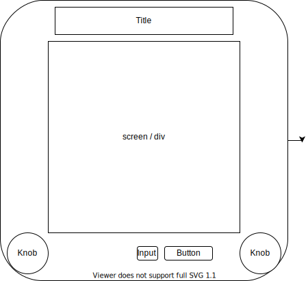

# etch-a-sketch

Etch-a-sketch project for the odin project.

- create 16x16 grid of squares with javascript
    - create function that creates a square div
    - create loop that runs required amount of times(tiles)^2 to create grid
    - set flex valuse to ensure consistent sizing
- create hover effect that changes color of square when you hover over it
    - create eventlistener for hover tag
    - make function to run on this to either add class or change background-color
    - bonus: change color each time a tile gets passed and add value to darkness
    - Design bonus: add listtener for which direction tile is getting entered from and use to aniimate knob / transform
- add button to clear grid and query amount of squares in new grid
    - Max 100
    - greate box on top for number to be added to maintain ease of use
    - delete current divs on click and create new amount based on number entered
    - animate container div with sand shake sound

- Design ideas
- add border around with appropriate color with title
- add shake to button for reset
- add spinning knobs that rotate based on mouse direction
    - https://codepen.io/azedo/pen/nywlc
    